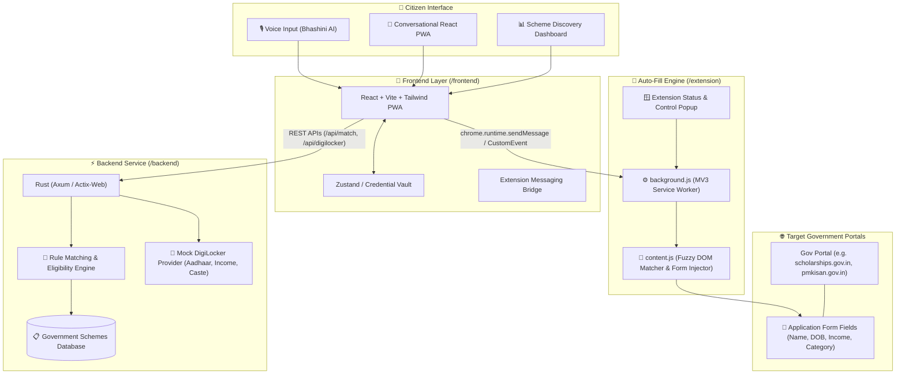

# 🏛️ Sahayak (सहायक)
> **AI-Driven E-Governance Scheme Discovery & Intelligent Auto-Fill Platform**

Sahayak is a next-generation civic-tech platform engineered to bridge the accessibility gap in government welfare distribution. It empowers citizens to discover eligible central and state government schemes through natural voice and text conversations, securely fetch authenticated credentials via DigiLocker, and automatically fill complex multi-page government application portals using a Chrome Extension bridge.

---

## 📐 System Architecture



---

## 🗂️ Monorepo Structure

```
sih/
├── README.md                      # Project documentation and developer guides
├── backend/                       # High-performance Rust backend service
│   ├── Cargo.toml                 # Rust dependencies & metadata
│   ├── src/
│   │   ├── main.rs                # HTTP Server entry point (Axum / Actix-Web)
│   │   ├── models/                # Domain structs (Citizen, Scheme, Rule, DigiLocker)
│   │   │   └── mod.rs
│   │   ├── services/              # Business logic & Rule matching engine
│   │   │   ├── digilocker.rs      # Mock DigiLocker credentials provider
│   │   │   ├── matcher.rs         # Deterministic + weighted eligibility evaluator
│   │   │   └── mod.rs
│   │   └── routes/                # API Route handlers (/api/match, /api/digilocker)
│   │       ├── match_routes.rs
│   │       ├── digilocker_routes.rs
│   │       └── mod.rs
│   └── tests/                     # Unit & integration tests for rule-matching
├── frontend/                      # Mobile-first React PWA
│   ├── package.json               # Frontend dependencies (React, Lucide, Tailwind)
│   ├── vite.config.js             # Vite bundler configuration
│   ├── tailwind.config.js         # Tailwind CSS styling config
│   ├── index.html                 # PWA HTML shell
│   └── src/
│       ├── App.jsx                # Application root with responsive layout
│       ├── main.jsx               # React entry point
│       ├── components/
│       │   ├── ChatInterface.jsx  # Conversational citizen assistant
│       │   ├── VoiceInput.jsx     # Bhashini-ready voice recognition placeholder
│       │   ├── SchemeDashboard.jsx# Scheme discovery & filtering dashboard
│       │   ├── CredentialCard.jsx # DigiLocker verified document card
│       │   └── AutoFillBanner.jsx # Extension trigger & auto-fill launch bar
│       ├── context/               # State store (User credentials & scheme matches)
│       │   └── AppContext.jsx
│       └── utils/
│           └── extensionBridge.js # Communication helper with Chrome Extension
└── extension/                     # Chrome Extension (Manifest V3)
    ├── manifest.json              # Extension manifest (MV3, permissions, externally_connectable)
    ├── background.js              # Service Worker (listens to web app & manages tabs)
    ├── content.js                 # Content script (fuzzy DOM element matching & auto-fill)
    ├── styles.css                 # Floating helper overlay injected into target portals
    ├── popup.html                 # Extension popup interface
    ├── popup.js                   # Popup controller script
    └── icons/                     # Extension icons (16px, 48px, 128px)
```

---

## 🚀 Quickstart & Development Guide

### Prerequisites
- **Rust Toolchain**: `cargo` & `rustc` (v1.75+)
- **Node.js**: `node` (v18+) and `npm` (v9+)
- **Google Chrome** (or Chromium-based browser)

---

### 1. Backend Service (Rust)

The backend handles heavy concurrent rule evaluation and provides a simulated DigiLocker API returning verified Aadhaar, Income Certificate, and Caste Certificate data.

```bash
# Navigate to the backend directory
cd backend

# Build and run the server (starts at http://127.0.0.1:8080)
cargo run
```

#### Key API Endpoints:
- `GET /api/health` — Health check
- `GET /api/digilocker/documents` — Simulated verified documents (Aadhaar & Income Certificate)
- `POST /api/match` — Match citizen profile against schemes database

---

### 2. Frontend Application (React PWA)

The frontend offers a conversational voice-ready UI and scheme discovery cards.

```bash
# Navigate to the frontend directory
cd frontend

# Install dependencies
npm install

# Start the Vite development server (starts at http://localhost:5173)
npm run dev
```

---

### 3. Chrome Extension (Auto-Fill Engine)

The extension acts as the intelligent bridge that fills target government portal forms using data securely fetched by the React app.

#### Installation Steps:
1. Open Google Chrome and navigate to `chrome://extensions/`.
2. Enable **Developer mode** toggle in the top-right corner.
3. Click **Load unpacked**.
4. Select the `sih/extension` directory.
5. Note the **Extension ID** generated by Chrome.
6. *(Optional during dev)*: Add your extension ID to `manifest.json` under `externally_connectable` and `frontend/src/utils/extensionBridge.js`.

---

## ⚡ Extension Bridge & Fuzzy Auto-Fill Mechanism

1. **Triggering Auto-Fill**: When the citizen selects "Auto-fill Application" on a scheme card, the React PWA broadcasts the normalized citizen profile payload to the extension via `chrome.runtime.sendMessage` (or window messaging).
2. **Payload Storage & Target Navigation**: The `background.js` service worker stores the session credentials and navigates the active tab to the scheme portal URL.
3. **Fuzzy DOM Matching (`content.js`)**:
   - Analyzes `<input>`, `<select>`, `<textarea>` elements across `id`, `name`, `aria-label`, `placeholder`, and nearest `<label>` text.
   - Applies normalized token matching (e.g., `["annual_income", "family income", "gross income"]` ➔ `profile.income`).
   - Dispatches native DOM `change`, `input`, and `blur` events to ensure reactive frameworks (React, Angular, Vue on target portals) recognize injected values.
   - Highlights successfully auto-filled fields with a subtle green outline.

---

## 🛡️ Security & Privacy Principles

- **Zero Data Retention**: Citizen biometric and identity information remains strictly on the client/ephemeral session.
- **Explicit Citizen Consent**: Auto-fill requires an explicit button click and presents a confirmation preview before injecting into DOM.
- **Sandboxed Execution**: Extension runs within Chrome Manifest V3 isolated worlds with minimal granular permissions (`activeTab`, `scripting`, `storage`).

---

## 👥 Contributors & Hackathon Team
- **Sahayak Core Team** — Smart India Hackathon (SIH)
